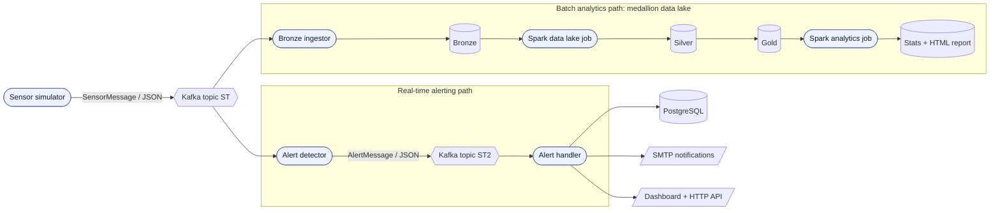

# Smart Grid Failure Detector

Real-time alerting and batch analytics pipeline for electrical grid telemetry, built as a distributed system in functional Scala. Simulated transformer sensors stream into Kafka, and the data fans out into two independent paths: a low latency alerting path that flags transformers at risk of failure, and a batch path that lands the raw stream in a medallion data lake for Spark analytics.

[](https://scala-lang.org)
[](https://www.scala-sbt.org)
[](https://kafka.apache.org)
[](https://spark.apache.org)
[](https://typelevel.org/cats-effect)

This started as a data engineering group project at EPITA. The brief was not clever analytics but a distributed architecture that actually runs, scales horizontally, and keeps its parts decoupled. Every service starts, stops, and scales on its own, and the only things they share are Kafka topics and a couple of storage backends.

> **Scope.** This is a proof of concept. The failure risk is computed by the simulator, not a trained model, and the analytics questions are there to exercise the data lake rather than to produce real forecasts. The value is in the architecture and the functional Scala codebase.

## Architecture



The raw sensor stream on topic `ST` is consumed twice, by design. The alert detector reads it for immediate decisions, and the bronze ingestor reads it to archive everything for later batch processing. Neither path knows the other exists. Services communicate only through Kafka and shared storage, so any of them can be stopped, restarted, or scaled out without touching the rest.

### Two paths, one goal

**Real-time path.** The alert detector applies severity thresholds to each message and republishes only the ones that matter, onto topic `ST2`. The alert handler then decides what to do with them: persist to PostgreSQL, send mail for critical events, and serve an operator dashboard.

**Batch path.** The bronze ingestor writes raw JSON to an S3-compatible object store. Two Spark jobs then refine it through a medallion layout (bronze to silver to gold) and answer a set of analytical questions, writing the results back to the lake as JSON and as a small HTML report.

## Components

| # | Component | Module | Role |
|---|-----------|--------|------|
| 1 | Sensor simulator | `sensor-simulator` | Generates synthetic transformer telemetry once per second and publishes it to Kafka topic `ST`. |
| 2 | Alert detector | `alert-detector` | Consumes `ST`, thresholds the risk score into a severity, republishes alerts to `ST2`. |
| 3 | Alert handler | `alert-handler` | Consumes `ST2`, stores alerts in PostgreSQL, sends mail for critical events, serves a dashboard and HTTP API. |
| 4 | Bronze ingestor | `bronze-ingestor` | Consumes `ST` and lands raw messages in the object store as the bronze layer. |
| 5 | Data lake job | `datalake` | Spark batch job: curates bronze into silver, aggregates silver into gold. |
| 6 | Analytics job | `analytics` | Spark batch job: answers analytical questions over gold, writes an HTML report. |
| - | Shared model | `shared` | Single source of truth for the JSON schemas and alert thresholds. |

## How detection works

The alert detector keeps its decision logic pure and separate from the Kafka plumbing, so the rules are unit tested without any broker running.

Detection is stateful per transformer. A single high reading is treated as a spike and does not raise an alert on its own. A warning is raised only when the risk stays at or above the warning threshold continuously for a configurable window, so a sustained drift alerts while a transient peak does not. A critical reading is urgent enough to fire immediately.

| Condition | Severity | Outcome |
|-----------|----------|---------|
| `score >= 0.9` | `CRITICAL` | Alert published immediately, mail sent downstream |
| `0.8 <= score < 0.9`, sustained for the window | `WARNING` | Alert published, no mail |
| `0.8 <= score < 0.9`, not yet sustained | none | Held as a spike |
| `score < 0.8` | none | No alert, streak reset |

The rule stays a pure function. It takes the moment the current streak started, the score, the current time, and the window, and returns the updated streak plus an optional severity:

```scala
def evaluate(since: Option[Long], score: Double, now: Long, window: Long): (Option[Long], Option[String]) = {
  val next      = if (score >= WarningThreshold) since.orElse(Some(now)) else None
  val sustained = next.exists(start => now - start >= window)
  val severity  = if (score >= CriticalThreshold || sustained) severityFor(score) else None
  (next, severity)
}
```

The per-transformer state lives in a `cats-effect` `Ref` and is updated atomically. Records for one transformer share a Kafka partition, so processing them in order keeps each streak correct. Effects that do not belong in the rule, the alert id and the detection timestamp, are generated in the effectful layer. That separation is why the tests need no broker and no clock.

## Message contracts

Both schemas live in the `shared` module so every service agrees on them.

**Input, topic `ST` (`SensorMessage`):**

```json
{
  "sensorId": "S-42137",
  "transformerId": "TR-318",
  "timestamp": "2026-06-25T12:00:00Z",
  "region": "Ile-de-France",
  "voltage": 231.4,
  "current": 82.7,
  "temperature": 78.5,
  "load": 88.0,
  "failureRiskScore": 0.93,
  "status": "CRITICAL"
}
```

**Output, topic `ST2` (`AlertMessage`):**

```json
{
  "alertId": "6f1c2b90-2c1e-4a3e-9f7a-2b5f9d0c1a44",
  "severity": "CRITICAL",
  "reason": "failureRiskScore=0.93 -> CRITICAL (warn>=0.8, crit>=0.9)",
  "detectedAt": 1782412800000,
  "source": { "...": "the full triggering SensorMessage" }
}
```

The alert embeds the whole triggering `SensorMessage` under `source` instead of copying individual fields. The handler gets full context and there is no schema drift between the two services.

## The data lake

The batch side follows a medallion layout on an S3-compatible store:

- **Bronze.** Raw Kafka messages written verbatim as JSON, one object per record, partitioned by Kafka partition and offset. Nothing is interpreted here.
- **Silver.** Cleaned and normalized Parquet: fields trimmed and cased, load rescaled to a 0 to 1 ratio, timestamps parsed to real event times, invalid rows dropped, an `isAlert` flag added. Partitioned by region.
- **Gold.** Hourly aggregates per transformer: average and peak risk, alert counts, measurement counts. This is the business-ready layer the analytics job reads.

The analytics job answers four questions over the gold layer and writes both JSON results and a static HTML report to the lake:

1. Regions ranked by average failure risk.
2. Transformers with the most alerts.
3. Average load by hour of day.
4. Failure risk trend over time.

## Tech stack

- **Language:** Scala 2.13, written in a functional style (no `var`, no mutable collections, no exceptions for control flow) using `cats-effect` and `fs2`.
- **Streaming:** `fs2-kafka` for consumers and producers as pure streams.
- **Messaging:** Apache Kafka in KRaft mode, three brokers.
- **JSON:** circe with semi-automatic derivation.
- **Batch:** Apache Spark (DataFrame API).
- **Storage:** MinIO for the S3-compatible data lake, PostgreSQL for alert history.
- **Mail:** Jakarta Mail (SMTP), with a file mode for local runs.
- **Build:** sbt multi-module. **Tests:** MUnit.

## Repository layout

```
smart-grid/
├── build.sbt                 # single root build, all module definitions and versions
├── docker-compose.yml        # 3-broker Kafka, PostgreSQL, MinIO
├── shared/                   # SensorMessage, AlertMessage, thresholds
├── sensor-simulator/         # component 1
├── alert-detector/           # component 2
├── alert-handler/            # component 3 (has its own README)
├── bronze-ingestor/          # component 4
├── datalake/                 # component 5 (Spark)
└── analytics/                # component 6 (Spark)
```

## Getting started

**Prerequisites:** JDK 17, [sbt](https://www.scala-sbt.org), and Docker with Compose.

**1. Start the infrastructure.** Three Kafka brokers, PostgreSQL, MinIO, and its bucket:

```bash
docker compose up -d kafka kafka2 kafka3 postgres minio
docker compose run --rm minio-init
```

Topics `ST` and `ST2` are created automatically on first use, with 6 partitions each.

**2. Run the real-time path.** Each command is a service; open a terminal per service:

```bash
sbt "simulator/run"                          # produce telemetry to ST
sbt "alertDetector/run"                       # ST  -> alerts -> ST2
SMART_GRID_MAIL_MODE=file sbt "alertHandler/run"   # ST2 -> PostgreSQL, mail, dashboard
```

`SMART_GRID_MAIL_MODE=file` writes a mail audit file instead of sending real email, which is what you want locally. The dashboard is then at `http://localhost:8082/dashboard`. See [`alert-handler/README.md`](alert-handler/README.md) for the full configuration and SMTP setup.

**3. Run the batch path.** Archive some messages, then refine and analyze:

```bash
BRONZE_MAX_MESSAGES=200 sbt "bronzeIngestor/run"   # ST -> bronze (stops after 200 messages)
sbt "datalake/run"                                  # bronze -> silver -> gold
sbt "analytics/run"                                 # gold -> stats + HTML report
```

Everything lands in the MinIO bucket `smartgrid-lake`. Browse it and open the generated report at the MinIO console, `http://localhost:9001` (user `smartgrid`, password `smartgrid`).

### Running the tests

```bash
sbt test                    # all modules
sbt "alertDetector/test"    # just the detection logic
```

## Design notes

A few decisions that make this more than a set of scripts:

- **Horizontal scaling comes for free.** Every consumer joins a Kafka consumer group. Run `sbt "alertDetector/run"` a second time and Kafka rebalances partitions across the two instances. No coordination code, no leader election, nothing to write.
- **The brokers are configured for real availability.** Three KRaft nodes, replication factor 3, minimum in-sync replicas of 2. A broker can go down without losing the pipeline.
- **Replays are safe.** Alert inserts use the alert id as primary key with `ON CONFLICT DO NOTHING`, and mail sends are claimed in PostgreSQL before they go out. Reprocessing the same Kafka offsets does not duplicate alerts or resend mail.
- **Pure core, effectful shell.** Decision logic is pure and unit tested; I/O, clocks, and UUIDs live in the `cats-effect` layer. This is the pattern across the streaming services.
- **One schema, no drift.** The `shared` module is the only place the message types are defined, so producers and consumers cannot disagree.

## Team

| Contributor | Focus |
|-------------|-------|
| Remi Brenaut | Alert detector, shared domain model, project setup |
| Quentin Lauret | Sensor simulator |
| Kevin Lubert | Alert handler |
| Edouard Andre | Data lake, analytics, bronze ingestor |

## Limitations and next steps

Honest about what this is and is not:

- The risk score is generated, not learned. A real system would put a model where the simulator's formula sits.
- Configuration is mostly environment variables and sensible defaults; there is no central config service.
- The sustained-window detection uses processing time. Reading the event time carried in each message instead would make it robust to consumer lag and replays.
- Thresholds and the detection window are compile-time constants. They could be read at runtime from a key value store to allow live tuning.
